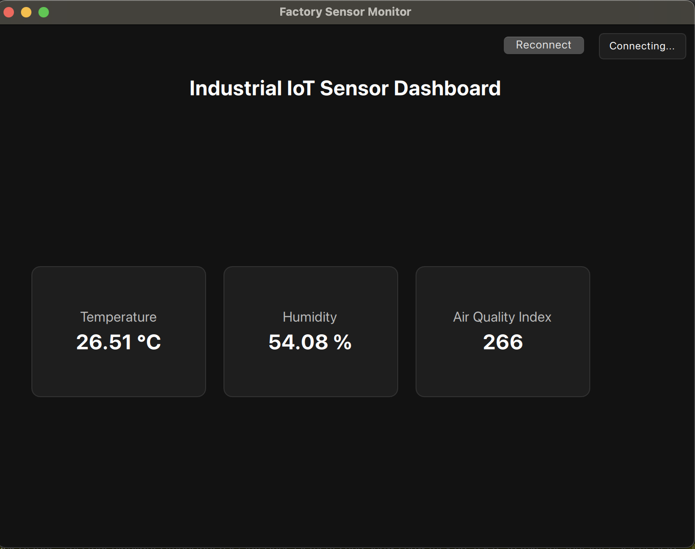

# QT Factory

## Description 

Qt Factory [Scythe Studio]
### Introduction
The aim of the project is to develop a system that imitates the workings of a modern factory using the Industrial Internet of Things.
 
### Scope
This project consists of several elements that communicate with each other using MQTT technology (ready to use QtMqtt module)

- "Sensors" - Participants are asked to simulate the operation of sensors (e.g. temperature measurement in the production hall, number of items on a conveyor belt, etc.). In the basic version, they can write a simple service that generates random data from time to time.
Additional points for - complex data, using docker containers, creating multiple "sensors" with separate application (maybe for generating data), using real hardware (this one may be complex)
- "Server" - Participants are to create an imitation of the server on which broker MQTT runs. The sensors created beforehand send information to this broker. They can use Mosquitto broker for that
Additional points for - using docker containers, changing options in default Mosquitto broker etc
- "Client" - Participants create a shop-floor admin panel application on which the data received from the broker is displayed. This point of the project may involve the most creative invention.
Additional points for - complex UI, using Qt Abstract models, using QSortFilterProxyModel for sorting and filtering, adding graphs, adding database for logs (embedding sqlite database), remote controlling of sensors

### 'Nice to Have' Features
Client app for both desktop and mobile
Adding RestAPI to client app to retrieve information from another application (like Postman)
Other fancy things ;)

### Expected Outcome
- The project by design is along the lines of 'the more you do, the better you will be judged'. The minimum scope is to create mockup sensors that, via a broker, send data to the client application and are displayed. 
- The project can be expanded with additional things listed in the project scope. Furthermore, participants can also prepare things such as diagrams or the introduction of access levels to applications (guest/user/administrator).
- We expect a README.md file within your project code that can provide a good overview, usage and brief documentation of the solution.
 
### Technical Implementation
Participants should use the C++ language as a base, together with the Qt framework and the QML language for GUIs. The most important module for communication will be Qt MQTT. Of the additional technologies, there will be an optional use of Docker.

## Dashboard

## Demo

- Clone this repo
- Spin up sensor and mosquitto MQTT broker by running `docker compose up`
- Open the QT_client folder in QT Creator and build the application
- Run the application

